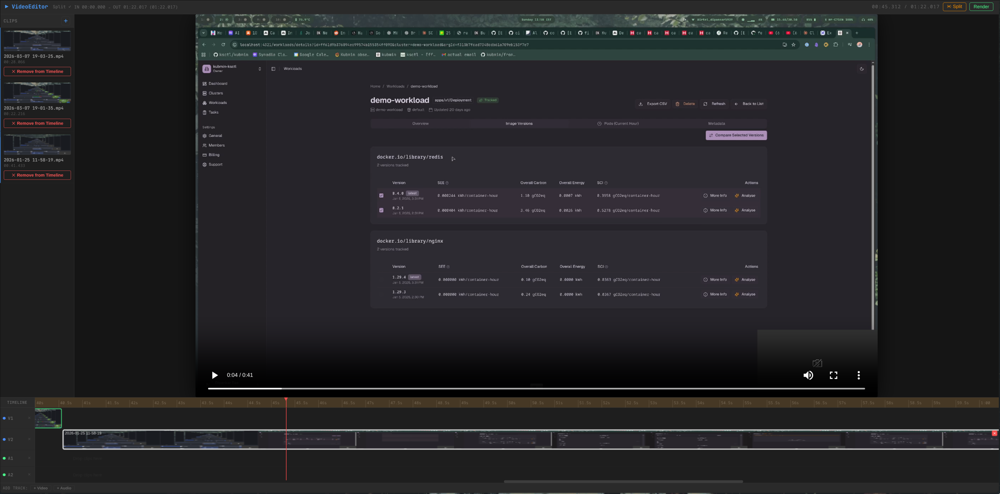

# VideoEditor

> [!NOTE]
> Closing this Repo infavour of using davinci resolve https://x.com/DipankarDas011/status/2043395345900798250?s=20

> [!WARNING]
> We are archiving this repo


Browser-based timeline video editor built with plain HTML/CSS/JS, Express, SQLite, and FFmpeg.



## What It Does

- Upload video, audio, and image files
- Arrange clips on multiple video and audio tracks
- Trim clips and set timeline in/out range
- Add per-track volume and mute
- Add clip fades and simple crossfades
- Add text overlays
- Save and load projects
- Export fixed-canvas renders in `4K`, `2K`, `Full HD`, or `720p`

## Stack

- Frontend: single-page app in [index.html](/home/dipankardas/ws/videoeditor/index.html)
- Server: Express in [server.js](/home/dipankardas/ws/videoeditor/server.js)
- Storage: SQLite via `better-sqlite3`
- Media pipeline: FFmpeg in [lib/ffmpeg.js](/home/dipankardas/ws/videoeditor/lib/ffmpeg.js)

## Requirements

- Node.js 18+
- FFmpeg installed and available on `PATH`
- Linux/macOS/WSL should work as long as FFmpeg is installed

Optional for faster MP4 export:

- NVIDIA GPU with working NVENC
- or Intel Quick Sync if your FFmpeg/runtime supports it

## Install

```bash
npm install
node server.js
```

Open:

```text
http://localhost:3000
```

If you want a different port:

```bash
PORT=4000 node server.js
```

## Media And Project Storage

- Uploaded media is stored in [`media/`](/home/dipankardas/ws/videoeditor/media)
- Project data is stored in the local SQLite database initialized on startup

## Export Behavior

Exports now use a real timeline render path:

- all video tracks are composited into the final frame
- all audio tracks and clip audio are mixed into the final audio output
- images are exported as fitted still-video segments
- output is always normalized to one of these canvases:
  - `4k` -> `3840x2160`
  - `2k` -> `2560x1440`
  - `fhd` -> `1920x1080`
  - `720p` -> `1280x720`

Scaling behavior:

- source media is fit into the chosen canvas
- aspect ratio is preserved
- letterboxing / pillarboxing is added when needed

## GPU Encoding

By default, MP4 export uses:

- `libx264`

The app logs the chosen encoder in the server console:

```text
[ffmpeg encoder] libx264 (default)
```

or

```text
[ffmpeg encoder] h264_nvenc (forced)
```

### Force A Specific MP4 Encoder

If you want hardware encoding, force the encoder explicitly when starting the server:

```bash
FFMPEG_MP4_ENCODER=h264_nvenc node server.js
```

Other supported values:

```bash
FFMPEG_MP4_ENCODER=h264_qsv node server.js
FFMPEG_MP4_ENCODER=libx264 node server.js
```

Notes:

- this override affects MP4 export
- WebM still uses VP9
- GIF export still uses the GIF pipeline
- the app does not auto-detect GPU encoders anymore

### Check What FFmpeg Supports

List available hardware acceleration methods:

```bash
ffmpeg -hide_banner -hwaccels
```

List available H.264 encoders:

```bash
ffmpeg -hide_banner -encoders | grep h264
```

Check whether NVENC works on your machine:

```bash
ffmpeg -hide_banner -f lavfi -i color=c=black:s=1280x720:r=30:d=1 -c:v h264_nvenc -f null -
```

Check whether QSV works on your machine:

```bash
ffmpeg -hide_banner -f lavfi -i color=c=black:s=128x128:r=30:d=1 -vf format=nv12,hwupload=extra_hw_frames=16 -c:v h264_qsv -f null -
```

If the command succeeds, you can start the app with the matching encoder:

```bash
FFMPEG_MP4_ENCODER=h264_nvenc node server.js
```

or

```bash
FFMPEG_MP4_ENCODER=h264_qsv node server.js
```

## Known Notes

- Hardware encode support depends on your FFmpeg build and driver/device access
- Even with NVENC enabled, parts of the render graph still run on CPU because scaling, overlay, fades, and audio mixing are filter-heavy
- Very large 4K timeline exports can still be CPU-heavy for that reason

## Main Files

- [server.js](/home/dipankardas/ws/videoeditor/server.js): Express entrypoint
- [index.html](/home/dipankardas/ws/videoeditor/index.html): frontend editor UI
- [lib/ffmpeg.js](/home/dipankardas/ws/videoeditor/lib/ffmpeg.js): render/export pipeline
- [routes/render.js](/home/dipankardas/ws/videoeditor/routes/render.js): export API
- [routes/upload.js](/home/dipankardas/ws/videoeditor/routes/upload.js): uploads

## Troubleshooting

### FFmpeg Not Found

Make sure this works:

```bash
ffmpeg -version
```

### Export Falls Back To CPU

Check the server log for:

```text
[ffmpeg encoder] libx264 (default)
```

If you know NVENC or QSV works from your shell, force it:

```bash
FFMPEG_MP4_ENCODER=h264_nvenc node server.js
```

### Images Or Mixed Aspect Ratio Clips Look Boxed

That is expected with the current fit-based export path. Media is padded to preserve aspect ratio instead of being stretched.
